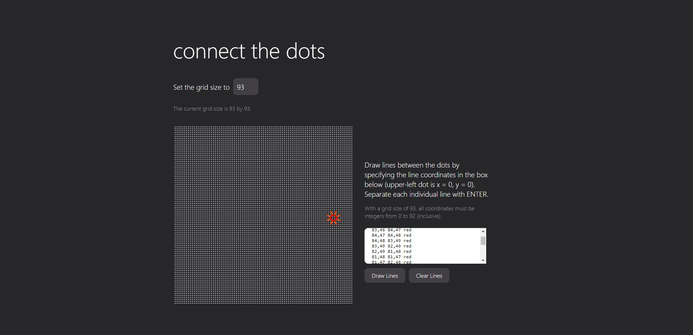

# Connect the Dots

Draw lines between dots on a React web canvas. This was my first exposure to React.js.

Deployed at: https://burnhc.github.io/connect-dots/

As a sample input, set the grid size to 100 and enter the following coordinates:

```
82,46 83,46 red
83,46 84,47 red
84,47 84,48 red
84,48 83,49 red
83,49 82,49 red
82,49 81,48 red
81,48 81,47 red
81,47 82,46 red

82,46 81,44 orangered
83,46 84,44 orangered
84,47 86,46 orangered
84,48 86,49 orangered
83,49 84,51 orangered
82,49 81,51 orangered
81,48 79,49 orangered
81,47 79,46 orangered
```
